# 🐾 PawLink - Lost & Found Pet Recovery Platform

A modern full-stack web application designed to help reunite lost pets with their owners through community-driven reporting, location tracking, and pet recovery management.

Built using **React**, **TypeScript**, **Vite**, **Tailwind CSS**, **Leaflet Maps**, and a secure role-based authentication system.

---

## 🌟 Project Overview

PawLink provides a centralized platform where users can:

* Report lost pets
* Report found pets
* Track locations using interactive maps
* Generate recovery flyers
* Bookmark important cases
* Manage pet reports
* Access role-based dashboards
* Support pet recovery efforts within their community

---

# 📸 Application Screenshots

## 🏠 Landing Page

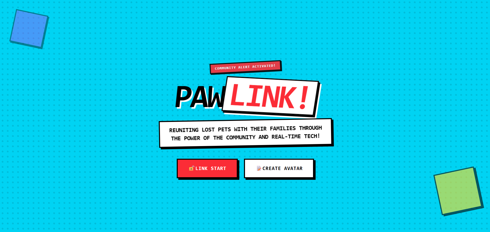

**Show:**

* Hero section
* Navigation bar
* Statistics section
* Main CTA buttons

---

## 🐕 Lost Pets Page

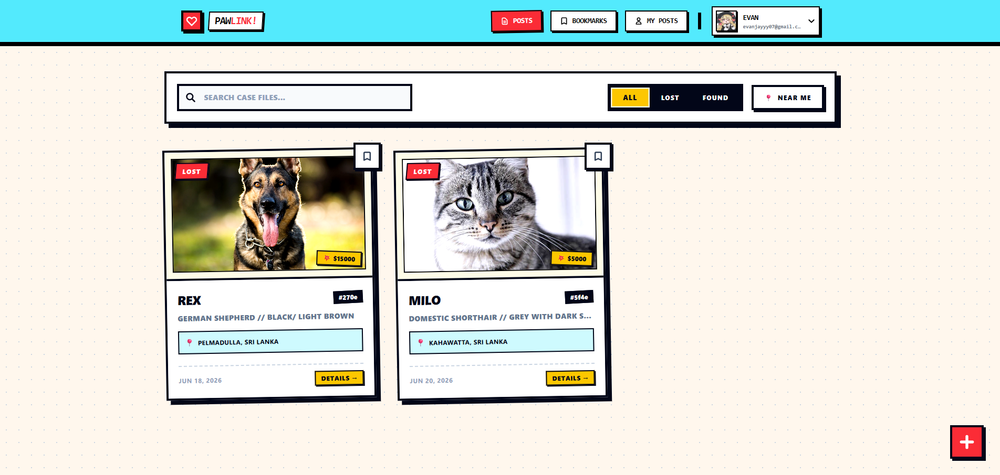

**Show:**

* Lost pet feed
* Search/filter area
* Pet cards

---

## 🐾 Found Pets Page

**Show:**

* Found pet listings
* Pet information cards

---

## ➕ Create Report Page

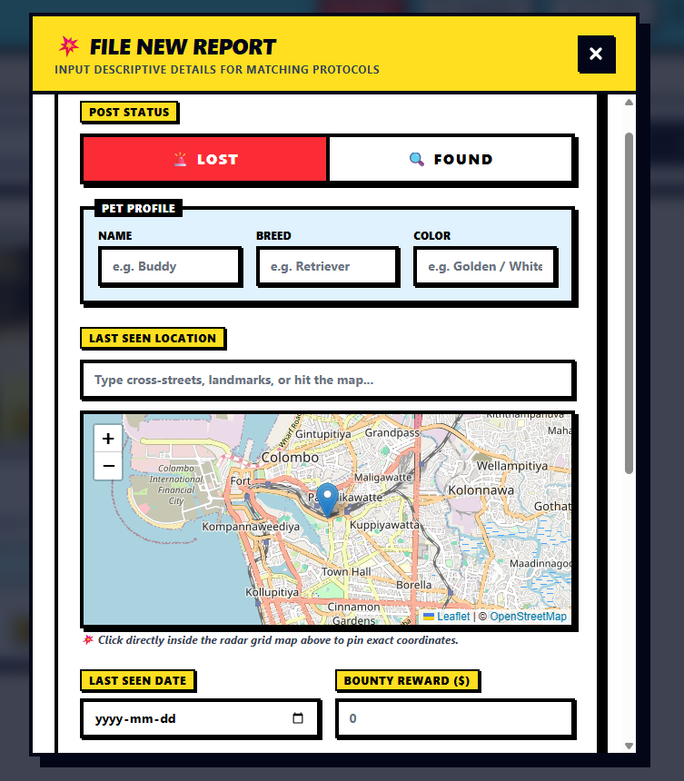

**Show:**

* Full report form
* Image upload section
* Pet details form

---

## 🗺️ Interactive Map Picker

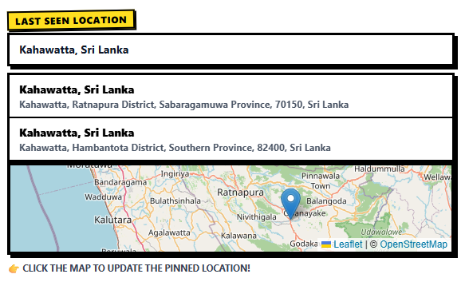

**Show:**

* Leaflet map
* Location marker
* Address selection

---

## 📋 Pet Details Page

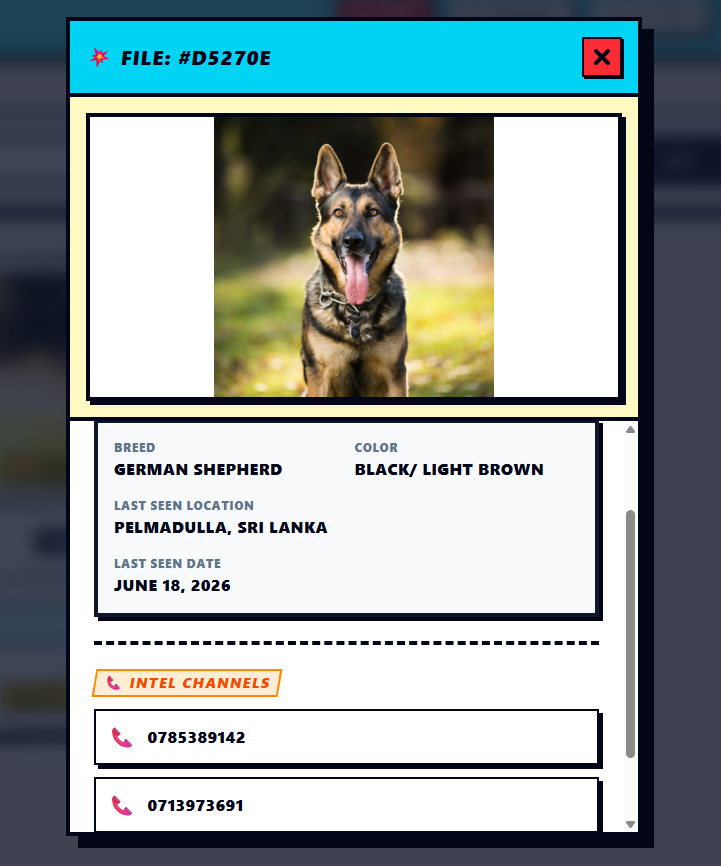

**Show:**

* Complete pet information
* Contact information
* Recovery details

---

## 🔖 Bookmark Management

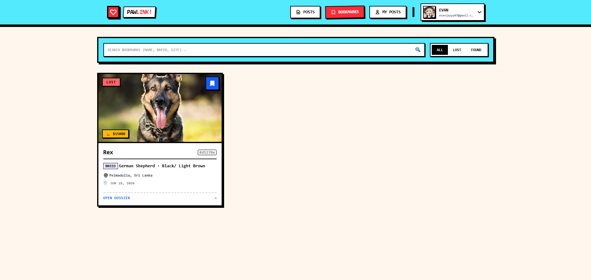

**Show:**

* Saved pet reports
* Bookmark list

---

## 👤 User Profile

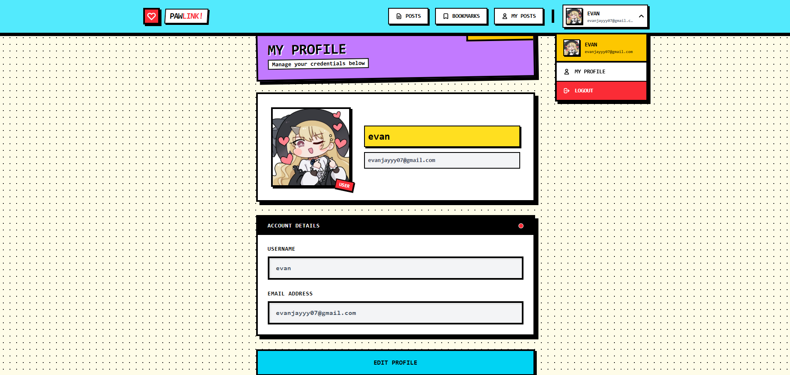

**Show:**

* User information
* Profile management

---

## 👑 Admin Dashboard

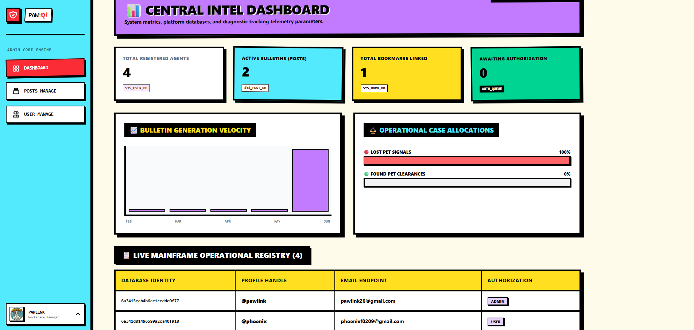

**Show:**

* Statistics cards
* Platform analytics
* Dashboard overview

---

## 👥 User Management

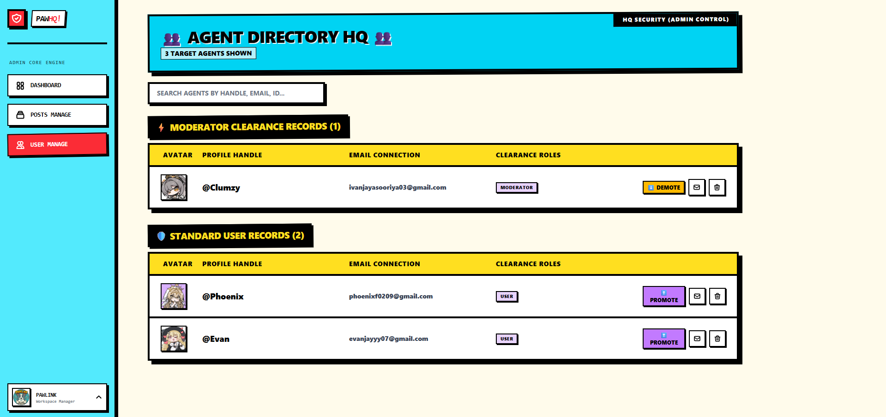

**Show:**

* User table
* Role management
* Administrative controls

---

## 🛡️ Moderator Dashboard

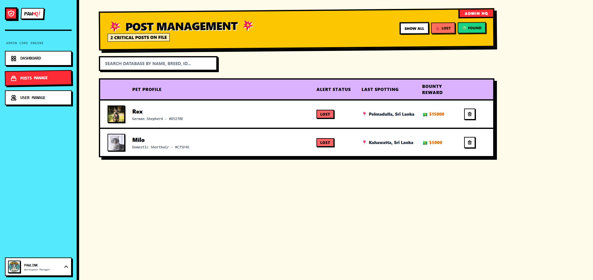

**Show:**

* Moderator tools
* Report management

---

## 📄 Recovery Flyer Generation

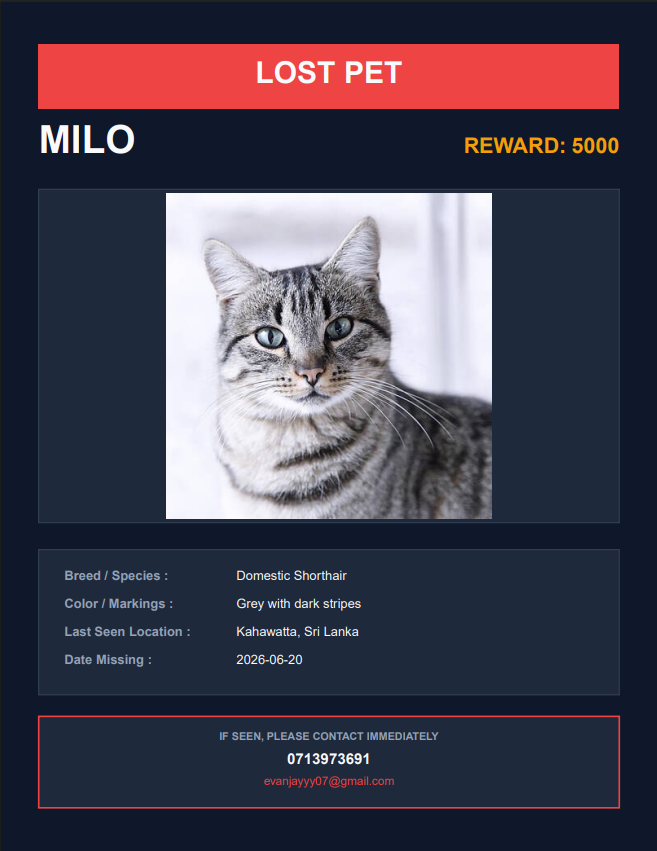

**Show:**

* Generated flyer preview
* Printable output

---

# ✨ Features

## 🔐 Authentication & Authorization

* User Registration
* Secure Login
* JWT Authentication
* Protected Routes
* Role-Based Access Control
* OTP Password Recovery
* Persistent User Sessions

---

## 🐾 Pet Report Management

### Lost Pet Reports

* Create lost pet reports
* Upload pet images
* Add detailed descriptions
* Set last-seen location
* Update report status

### Found Pet Reports

* Report found animals
* Add discovery location
* Upload images
* Provide contact information

---

## 🗺️ Location Tracking

* Interactive Leaflet Maps
* Location Marker Placement
* Coordinate Storage
* Visual Location Display

---

## 📷 Image Upload System

* Pet Photo Upload
* Image Preview
* Multipart Form Handling
* Media Storage Integration

---

## 🔖 Bookmark System

Users can:

* Save important cases
* Remove saved cases
* View bookmarked reports
* Quickly revisit active reports

---

## 📄 Flyer Generation

Generate printable recovery flyers containing:

* Pet Information
* Pet Photo
* Contact Details
* Last Seen Location
* Reward Information

---

## 📊 Administrative Features

### Admin

* User Management
* Role Assignment
* Post Management
* Analytics Dashboard
* Platform Monitoring

### Moderator

* Community Monitoring
* Report Review
* Content Moderation
* Case Assistance

---

# 🏗️ System Architecture

## High-Level Architecture

```text
┌───────────────────────────┐
│        User Browser       │
└─────────────┬─────────────┘
              │
              ▼
┌───────────────────────────┐
│ React + TypeScript Client │
│          (Vite)           │
└─────────────┬─────────────┘
              │
        Axios Requests
              │
              ▼
┌───────────────────────────┐
│      Express Backend      │
│        REST APIs          │
└─────────────┬─────────────┘
              │
              ▼
┌───────────────────────────┐
│         MongoDB           │
└───────────────────────────┘
```

---

## Authentication Flow

```text
User Login
    │
    ▼
Frontend
    │
    ▼
POST /auth/login
    │
    ▼
Backend Validation
    │
    ▼
JWT Generated
    │
    ▼
Token Stored
    │
    ▼
Protected Routes Access
```

---

## Pet Reporting Flow

```text
Create Report
      │
      ▼
Enter Pet Information
      │
      ▼
Upload Pet Image
      │
      ▼
Select Location
      │
      ▼
Submit Report
      │
      ▼
Backend Validation
      │
      ▼
Database Storage
      │
      ▼
Published to Feed
```

---

# 🛠️ Technology Stack

## Frontend

* React
* TypeScript
* Vite
* Tailwind CSS
* React Router DOM
* Axios
* Framer Motion
* Leaflet
* React Leaflet
* Lucide React
* Chart.js

## Development Tools

* ESLint
* TypeScript ESLint
* Git & GitHub

---

# 📁 Project Structure

```text
src/
├── assets/
├── components/
├── context/
├── hooks/
├── layouts/
├── pages/
├── router/
├── service/
├── App.tsx
└── main.tsx
```

---

# 🚀 Getting Started

## Prerequisites

* Node.js 18+
* npm

---

## Clone Repository

```bash
git clone https://github.com/ivanjayyy/rad-final-coursework-fe.git

cd rad-final-coursework-fe
```

---

## Install Dependencies

```bash
npm install
```

---

## Configure Environment Variables

Create a `.env` file:

```env
VITE_API_URL=your_backend_api_url
```

---

## Start Development Server

```bash
npm run dev
```

Application will run at:

```text
http://localhost:5173
```

---

## Build for Production

```bash
npm run build
```

---

## Preview Production Build

```bash
npm run preview
```

---

# 🔒 Security Features

* JWT Authentication
* Protected Routes
* Role-Based Authorization
* OTP Verification
* Secure API Communication

---

# 📈 Future Enhancements

* Real-Time Notifications
* AI-Based Pet Recognition
* Finder/Owner Chat System
* Mobile Application
* Advanced Search Filters
* Push Notifications
* Social Media Integration

---

# 🤝 Contributing

1. Fork the repository

2. Create a feature branch

```bash
git checkout -b feature/new-feature
```

3. Commit changes

```bash
git commit -m "Add new feature"
```

4. Push changes

```bash
git push origin feature/new-feature
```

5. Open a Pull Request

---

# 📜 License

This project was developed for academic and educational purposes.

---

# 👨‍💻 Author

**Ivan Adithya**

GitHub: https://github.com/ivanjayyy

---

## 🐾 Helping Lost Pets Find Their Way Home
